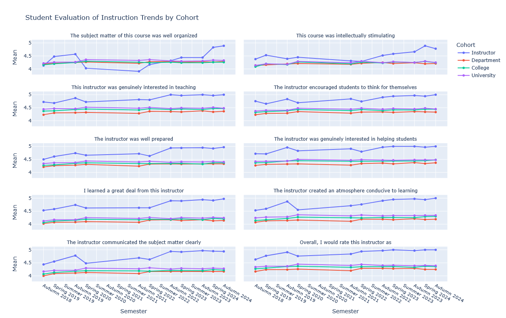
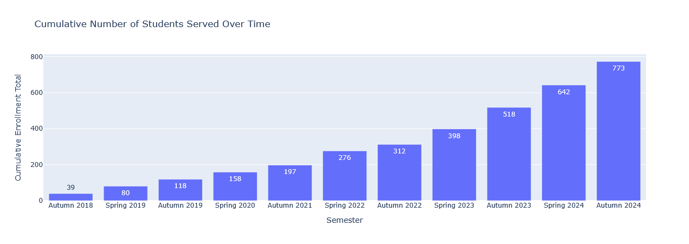

# Grifski Educator Dashboard

This is a Plotly dashboard that is no longer hosted due to privacy concerns.
I have kept the source code here for viewing purposes, but I only launch
the dashboard locally to generate new plots. The repo will remain active for
that purpose only.

If you want to get this working locally for yourself, you will need to create a
variety of CSVs and drop them in the data folder. However, I do not intend to
share the format of those files (mostly because I don't have time). The repo
that used to hold the data files has been closed given the rapid
enshittification of Microsoft and GitHub.

## Key Figures

I will, of course, share some of the figures below here. I also will post
similar (and more current) figures on my website.

